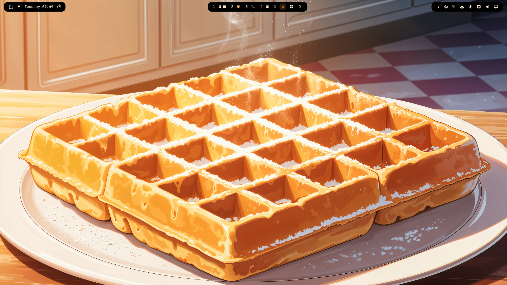
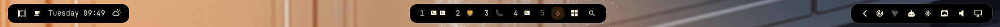

# Islands

The [Omarchy](https://omarchy.org/) bar, split into three floating islands. The left, center, and right sections each sit on their own rounded background, sized to their widgets, with the wallpaper showing in between.





Islands is a full bar, not a widget. It uses your existing widgets and layout, so everything you've added to the bar keeps working. Corners follow your Hyprland window rounding and the gaps line up with your window gaps.

## Requirements

- Omarchy (Quattro)

## Installation

```sh
omarchy plugin add https://github.com/DanielLob-o/Islands.git
omarchy bar use lobo.islands
```

To go back to the stock bar:

```sh
omarchy bar reset
```

## Configuration

Add an `islands` object to the `bar` section of `~/.config/omarchy/shell.json`. Every key is optional.

```json
{
  "bar": {
    "id": "lobo.islands",
    "islands": {
      "color": "#000000",
      "opacity": 1,
      "radius": -1,
      "borderOpacity": 0.14
    }
  }
}
```

| Key | Default | Description |
|---|---|---|
| `color` | `#000000` | Island color, as `#rrggbb`, or `auto` to follow the theme's bar background |
| `opacity` | `1` | Island opacity, `0` to `1` |
| `transparentOpacity` | `0.6` | Opacity while the bar's transparent mode is on |
| `radius` | `-1` | Corner radius in pixels. `-1` follows Hyprland's window rounding. |
| `borderOpacity` | `0.14` | Border strength, `0` to `1` |
| `borderWidth` | `1` | Border width in pixels. `0` removes it. |
| `padding` | `10` | Space between an island's edge and its first and last widget |

Text switches between light and dark to stay readable on the island color. Set `color` to `auto` to make the islands themselves follow the Omarchy theme — light islands on light themes, dark islands on dark ones.

Everything else works as on the stock bar: move widgets with `omarchy bar move`, drag them on the bar, and double-click empty center space to toggle transparency.

## Known issues

### Some plugin widgets do not work

Omarchy trusts only its stock bar. When a third-party bar is active, Omarchy gives it a restricted shell API, so that a bar cannot get access to other plugins' data. This affects any third-party bar, including ones made with `omarchy plugin clone omarchy.bar`.

Under a third-party bar, a widget's `bar.shell.serviceFor(...)` always returns `null`, and the shell's internal objects are not available. Widgets that use these do not work correctly. Known examples:

- [Den](https://github.com/SaifOmar/so.den): cannot read its config or add plugins, and its icons disappear.
- [Solfa](https://github.com/SirAllap/omarchy-solfa): the panel opens empty.
- [OmaTasks for Todoist](https://github.com/crmne/omatasks): the panel does not open.

Islands cannot work around this without breaking Omarchy's security rule. The fix must come from Omarchy. See [#1](https://github.com/DanielLob-o/Islands/issues/1). If you need these widgets, use the stock bar:

```sh
omarchy bar reset
```

### Widgets disappear after a config change

Omarchy rebuilds third-party bars when `shell.json` changes, and some built-in widgets can disappear after the rebuild. This affects any third-party bar. If widgets go missing after a config change, run:

```sh
omarchy restart shell
```

## Removal

```sh
omarchy bar reset
omarchy plugin remove lobo.islands
```

## Credits

`Bar.qml` and `BarModel.js` are based on the Omarchy bar by David Heinemeier Hansson, released under the MIT License.

## License

MIT. See [LICENSE](LICENSE).
